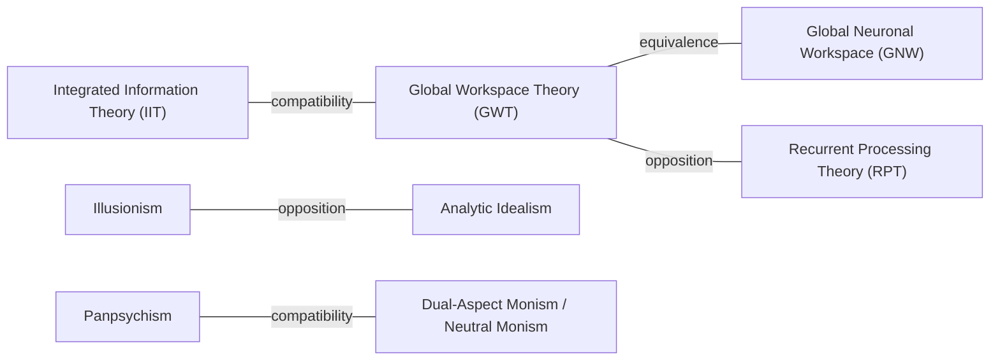

# Relations graph

Below is a Mermaid flowchart depicting current relations among theories in data/theories.json.

Notes
- "equivalence" indicates near-identity or implementation relation.
- "compatibility" and "opposition" are undirected conceptual relations.
- Update data/theories.json -> relations to expand this graph; we can regenerate on demand.

